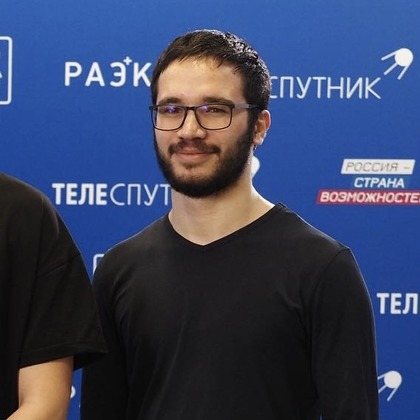

## Я - Загидин Селимов

Приветствую тебя на моей персональной странице!  
Тут я написал о себе, своих навыках и интересах :)

### Основное образование
**ФГБОУ ВО "АГТУ"** (2019 - н.в)  
г. Астрахань, бакалавриат.
Направление: “Информатика и
вычислительная техника”.  
Тема дипломной работы: “Рефакторинг и
реинжиниринг интегрированной среды
Semantic IDE”  
**МКОУ "СОШ №2"** (2017-2019)  
г. Избербаш, среднее (полное)
образование

### Навыки, используемые в работе
Мобильные приложения -> **Dart/Flutter**  
Веб-приложения и веб-сервисы -> **C#/ASP.NET**

### Прочие навыки
- Python, OpenCV, SpaCy, TensorFlow
- Java 8/Android (Retrofit 2, JavaRX)
- SQL, MySQL, MongoDB
- HTML, CSS (SCSS, LESS)
- PHP
- JS, JQuery
- Bootstrap
- Git, Gihub, Github Actions, CI/CD
- Design patterns, BloC, MVC, MVP, MVVM

### Моя работа
- 09.2021 - н.в.: **Adeptik**  
[СНАРЯД | APS](https://adeptik.com/snaryad-aps/) - Система оптимизационного планирования для производства
- 03.2021 - н.в.: **Secret Company** :)  
Мобильное приложение для сервисной компании

### Участие в хакатонах
- 12.2021 - Цифровой прорыв Финал (10 место)
- 10.2021 - VTB MoreTech 3.0 (Топ 10)
- 09.2021 - Цифровой прорыв (2 место)
- 12.2021 - IITIK HACK (1 место)

### Стажировки в ОЦ"Сириус"
- **Саммит молодых ученых и
инженеров «Большие вызовы для
общества, государства и науки»**  
26 АПРЕЛЯ 2021 – 30 АПРЕЛЯ 2021  
- **«Классическое
программирование и мобильная
разработка» от Mail.ru**  
2 ЯНВАРЯ 2019 – 25 ЯНВАРЯ 2019  
- **«Большое вызовы»**  
1 ИЮЛЯ 2018 – 26 ИЮЛЯ 2018  

### Мои контакты
- Телеграм: [@seljmov](https://t.me/seljmov)
- Вконтакте: [@seljmov](https://vk.com/seljmov)
- Фейсбук: [@seljmov](https://facebook.com/seljmov)